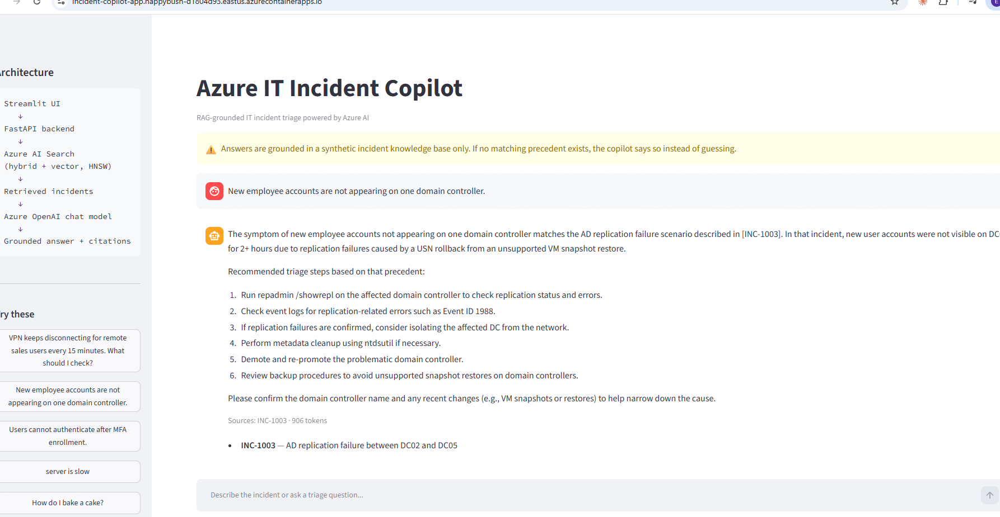
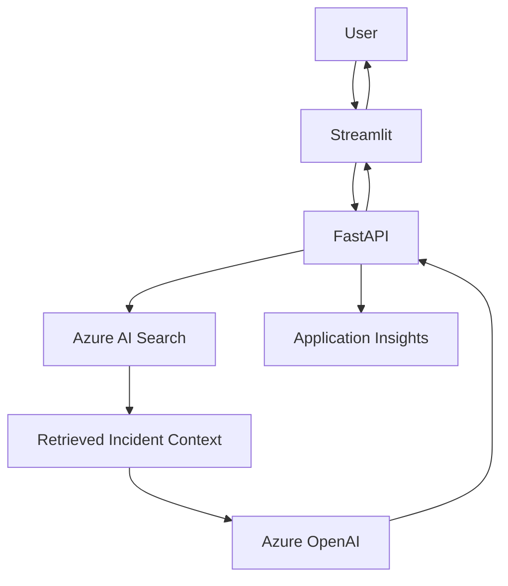
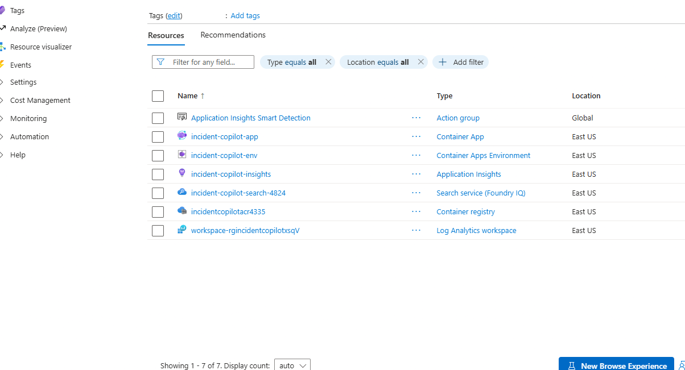
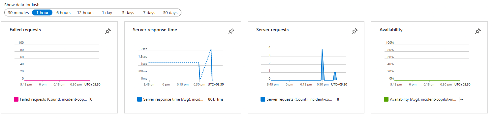

# Azure IT Incident Copilot

**RAG-powered IT incident triage on Azure** — Streamlit → FastAPI → Azure AI Search (vector + keyword) → Azure OpenAI → grounded answer with incident citations.

  

> **Demo video (4 min):** [Watch on YouTube](https://youtu.be/VAVasUHeNmY)



## Overview
A chat assistant that answers IT service-desk questions ("VPN drops every 15 minutes", "AD accounts missing on one DC") by retrieving similar past incidents and grounding the model's answer in them — with explicit incident IDs as citations.

## Problem Statement
Service-desk engineers re-solve the same incidents repeatedly. Tribal knowledge lives in old tickets, and a plain LLM will happily invent plausible but wrong root causes and fixes. In IT operations a confident wrong answer (e.g. "demote the domain controller") is worse than no answer.

## Solution
Retrieval-Augmented Generation (RAG):
1. Incident tickets are embedded (`text-embedding-3-small`, 1536-d) and indexed in Azure AI Search (HNSW).
2. Each question runs a **hybrid** (BM25 + vector) query for the top-4 precedents.
3. The model answers **only** from that context, cites incident IDs, asks for clarification when the question is vague, and refuses out-of-scope questions.

## Architecture

More detail: [docs/architecture.md](docs/architecture.md)

## Tech Stack
- **Azure OpenAI** (Azure AI Foundry): `text-embedding-3-small` + chat model (default deployment name configurable; see note below)
- **Azure AI Search** (Basic) — HNSW vector index + keyword hybrid
- **FastAPI**, **Pydantic**, **Streamlit**
- **Docker**, Azure Container Registry, Azure Container Apps
- **Application Insights** (via `azure-monitor-opentelemetry`, enabled when a connection string is set)

> **Model note:** the original plan used `gpt-4o-mini`, which Azure retired on 2026-03-31. This build uses `gpt-4.1-mini` (same class: small, cheap, pay-as-you-go Standard). Swap models by changing `AZURE_OPENAI_DEPLOYMENT` — no code changes.

## Quick Start
```bash
git clone https://github.com/emran-Automation-Techlead/azure-it-incident-copilot
cd azure-it-incident-copilot
python -m venv venv && source venv/bin/activate      # Windows: venv\Scripts\activate
pip install -r requirements.txt
cp .env.example .env                                  # fill in your Azure endpoints/keys

python index_builder.py                               # creates index + uploads 20 incidents
uvicorn app.main:app --reload --port 8000             # backend
streamlit run frontend/streamlit_app.py               # UI on :8501
```

### API
```bash
curl http://localhost:8000/health
curl -X POST http://localhost:8000/chat -H "Content-Type: application/json" \
  -d '{"query": "VPN keeps disconnecting for remote sales users every 15 minutes. What should I check?"}'
```
Response: `{"answer": "...", "sources": [{"id": "INC-1001", "title": "..."}], "tokens_used": 864}`

## Verified Behaviour
| Query | Result |
|---|---|
| VPN disconnecting every 15 min | Retrieves & cites **INC-1001**, lists timeout/NAT/keep-alive checks |
| New accounts missing on one DC | Cites **INC-1003** (AD replication / USN rollback) |
| Users can't authenticate after MFA enrollment | Cites **INC-1005** (clock drift, legacy per-user MFA) |
| "server is slow" | Asks clarifying questions instead of guessing |
| "How do I bake a cake?" | Scope refusal, **no citations** |
| "Which incident IDs support your recommendation?" | Lists the explicit IDs (uses conversation history) |

Run the suite (needs live Azure resources): `pytest tests -q` → 14 tests (retrieval, source IDs, invalid input, out-of-domain, follow-up).

## Screenshots
| Azure resources (`rg-incident-copilot`) | Application Insights (8 requests, 0 failures, ~861 ms avg) |
|---|---|
|  |  |

## Hallucination Controls
- Grounding system prompt; "no matching precedent found" is an explicit, allowed answer.
- Out-of-domain → scope refusal, zero citations.
- API returns only sources the answer actually cites.
- Temperature 0.2.

## Deployment
```bash
az acr build -r <acr> -t incident-copilot:v1 .          # cloud build, no local Docker needed
az containerapp create ... --secrets openai-key=... search-key=... \
  --env-vars AZURE_OPENAI_KEY=secretref:openai-key AZURE_SEARCH_KEY=secretref:search-key ...
```
Keys are passed as Container Apps secrets; nothing sensitive is in the image, repo, or Dockerfile (`.env` is git- and docker-ignored). The container runs FastAPI (8000) and Streamlit (8501) together via `start.sh`; splitting them into two apps is the natural next step.

### Deployment status
Deployed to Azure Container Apps (single container: Streamlit + FastAPI), image in Azure Container Registry, API keys held as Container Apps secrets, telemetry in Application Insights. The public URL is intentionally not listed here to avoid uncontrolled model spend; the screenshots above are the evidence. Note: ACR Tasks were unavailable on this subscription, so the image was built locally with Docker and pushed.

## What I'd Build Next
- Split frontend/backend into separate Container Apps
- Managed identity instead of API keys
- Foundry Agent Service / multi-agent escalation flow
- Cosmos DB conversation persistence
- Streaming responses, reranking, evaluation set with automated groundedness scoring
- CI/CD (GitHub Actions) and IaC (Bicep/Terraform)

## Data
All 20 incidents in `data/incidents.jsonl` are **synthetic** — no real company information.

## License
MIT
