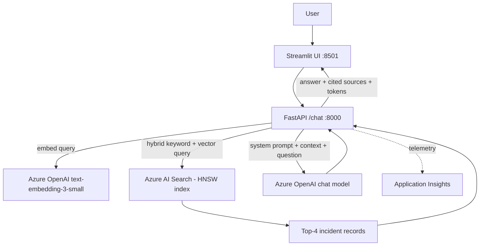

# Architecture

## Request flow
1. Streamlit sends `{query, history}` to `POST /chat`.
2. The backend embeds the query (1536-d) and runs a **hybrid** query (BM25 keyword + vector) against `incidents-index`.
3. The top 4 incidents are injected into the prompt as `[INC-xxxx] title + content`.
4. The model answers under a strict grounding prompt (no invented IDs/root causes, refuse out-of-scope, ask for clarification when vague).
5. The API returns only the sources the answer actually cites, plus token usage.

## Hallucination controls
- Grounding system prompt: retrieved context is the source of truth; "no matching precedent" is an allowed answer.
- Out-of-domain questions get a scope refusal and **zero** citations.
- Sources are filtered to IDs the model cited, so refusals never display irrelevant "evidence".
- Low temperature (0.2).

## Index schema
| Field | Type | Notes |
|---|---|---|
| id | String (key) | `INC-xxxx` |
| title | String | searchable |
| content | String | title + severity + symptoms + root cause + resolution, searchable |
| category | String | filterable, facetable |
| embedding | Collection(Single) | 1536 dims, HNSW, `default-profile` |
